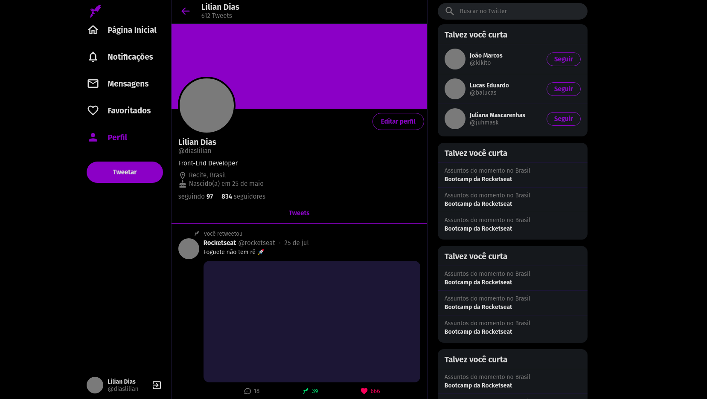

<h1 align="center">
    
</h1>

<h4 align="center"> 
	Interface do Twitter com ReactJS
</h4>

<p align="center">
	
## 💻 Sobre o Projeto
Neste projeto em React.JS clonamos a interface do Twitter.

#### A aplicação foi criada seguindo a videoaula [Twitter Responsivo com ReactJS | UI Clone #6](https://www.youtube.com/watch?v=K-8z_4xvT3o) disponíbilizada pela Rocketseat.
  
## 🎨 Layout

O layout da aplicação está disponível no Figma:

<a href="https://www.figma.com/file/cjNh1bd93pbJBFOza25K7L/Rocketseat-Twitter-Clone?node-id=1%3A2">
  
</a>

## 🛠 Tecnologias
Abaixo segue o que foi utilizado na criação deste projeto:

o de código consistente entre diferentes editores, IDE's ou ambientes;

- [TypeScript](https://www.typescriptlang.org/)
- [React](https://pt-br.reactjs.org/)
- [Styled-components](https://styled-components.com/)
</p>


## 🚀 Como executar o projeto

1. Copie ou clone os arquivos deste repositório para uma pasta local.

2. Acesse a pasta local do projeto através de um terminal e faça a instalação das dependências usando o comando:
```sh
$ npm install
```

1. Ainda na pasta local do projeto execute o comando:
```sh
$ npm start
```

A aplicação é geralmente iniciada no endereço: `http://localhost:3000` e utiliza dados estáticos que estão em um array no arquivo `api.js` na pasta `services`.


## 😯 Como contribuir para o projeto

1. Faça um **fork** do projeto.
2. Crie uma nova branch com as suas alterações: `git checkout -b my-feature`
3. Salve as alterações e crie uma mensagem de commit contando o que você fez: `git commit -m "feature: My new feature"`
4. Envie as suas alterações: `git push origin my-feature`
> Caso tenha alguma dúvida confira este [guia de como contribuir no GitHub](https://github.com/firstcontributions/first-contributions)


## 📝 Licença

Este projeto esta sobe a licença MIT.

Feito com ❤️ por Rafael Ramires 👋🏽 [Entre em contato!](https://www.linkedin.com/in/rafael-ramires-791aa378/)
